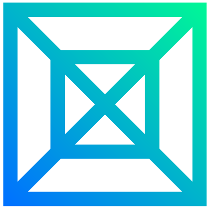

<!-- 

 -->

<!---->

<!--

I am a Grenadian aspiring cybersecurity professional currently pursuing an <b>Associate's Degree in Information Technology</b> at <b><a href="https://www.tamcc.edu.gd/">T.A. Marryshow Community College</a></b> and a graduate of the <b><a href="https://www.cyber-nations.com/" target="_blank">Cyber Nations</a> × <a href="https://protexxa.com/">Protexxa</a> Cybersecurity Bootcamp (Cohort 1 - Grenada)</a></b>, where I developed hands-on skills in <b>network defense</b>, <b>vulnerability analysis</b>, <b>threat intelligence</b>, and <b>incident response</b>.

Passionate about <b><a href="https://www.fortinet.com/resources/cyberglossary/what-is-secops">security operations</a></b> and <b><a href="https://www.sentinelone.com/cybersecurity-101/cybersecurity/defensive-cyber-security/">defensive cybersecurity</a></b>, with a strong interest in entry-level roles focused on <b>monitoring</b>, <b>protecting</b>, and <b>strengthening digital environments</b>. I approach cybersecurity with <b>precision</b>, <b>critical analysis</b>, and <b>proactive defense</b>, and I am committed to understanding system architectures and implementing effective security measures. <b>Continuous learning</b>, <b>hands-on projects</b>, and <b><a href="https://www.linkedin.com/in/ahndre-walters/">certifications</a></b> are central to my growth as a <b><a href="https://cybersecuritynews.com/blue-team/">Blue Team</a> professional</b>, while helping build <b>safer digital spaces</b>.

-->

<!--

I am a Grenadian aspiring cybersecurity professional currently pursuing an <b>Associate's Degree in Information Technology</b> at <b><a href="https://www.tamcc.edu.gd/">T.A. Marryshow Community College</a></b> and a graduate of the <b><a href="https://www.cyber-nations.com/" target="_blank">Cyber Nations</a> × <a href="https://protexxa.com/">Protexxa</a> Cybersecurity Bootcamp (Cohort 1 - Grenada)</b>, where I developed hands-on skills in <code>network defense</code>, <code>vulnerability analysis</code>, <code>threat intelligence</code>, and <code>incident response</code>.

Passionate about <b><a href="https://www.fortinet.com/resources/cyberglossary/what-is-secops">security operations</a></b> and <b><a href="https://www.sentinelone.com/cybersecurity-101/cybersecurity/defensive-cyber-security/">defensive cybersecurity</a></b>, with a strong interest in entry-level roles focused on <code>monitoring</code>, <code>protecting</code>, and <code>strengthening digital environments</code>. I approach cybersecurity with <b>precision</b>, <b>critical analysis</b>, and <b>proactive defense</b>, and I am committed to understanding system architectures and implementing effective security measures. <code>Continuous learning</code>, <code>hands-on projects</code>, and <b><a href="https://www.linkedin.com/in/ahndre-walters/">certifications</a></b> are central to my growth as a <b><a href="https://cybersecuritynews.com/blue-team/">Blue Team professional</a></b>, while helping build <b>safer digital spaces</b>.

-->

I am a <b>Grenadian aspiring cybersecurity professional</b> currently pursuing an <b>Associate's Degree in Information Technology</b> at <b><a href="https://www.tamcc.edu.gd/">T.A. Marryshow Community College</a></b> and a <b>graduate</b> of the <b><a href="https://www.cyber-nations.com/" target="_blank">Cyber Nations</a> × <a href="https://protexxa.com/">Protexxa</a> Cybersecurity Bootcamp (Cohort 1 - Grenada)</b>, where I developed <b>hands-on skills</b> in <code>network defense</code>, <code>vulnerability analysis</code>, <code>threat intelligence</code>, and <code>incident response</code>. <b>Passionate</b> about <b><a href="https://www.fortinet.com/resources/cyberglossary/what-is-secops">security operations</a></b> and <b><a href="https://www.sentinelone.com/cybersecurity-101/cybersecurity/defensive-cyber-security/">defensive cybersecurity</a></b>. <b>Available</b> on this  is my <b><a href="https://github.com/AhndreWalters?tab=repositories">portfolio</a></b> of <code>practical projects</code>, <code>lab exercises</code>, and <code>hands-on work</code>. <b>Connect</b> with me on , where my <code>certifications</code> are also featured.

<h1></h1>

    &nbsp;&nbsp;&nbsp;&nbsp;
    &nbsp;&nbsp;&nbsp;&nbsp;
    &nbsp;&nbsp;&nbsp;&nbsp;
    &nbsp;&nbsp;&nbsp;&nbsp;
    &nbsp;&nbsp;&nbsp;&nbsp;
    &nbsp;&nbsp;&nbsp;&nbsp;
    &nbsp;&nbsp;&nbsp;&nbsp;
    &nbsp;&nbsp;&nbsp;&nbsp;
    &nbsp;&nbsp;&nbsp;&nbsp;
    &nbsp;&nbsp;&nbsp;&nbsp;
    &nbsp;&nbsp;&nbsp;&nbsp;
    &nbsp;&nbsp;&nbsp;&nbsp;
    &nbsp;&nbsp;&nbsp;&nbsp;
    &nbsp;&nbsp;&nbsp;&nbsp;
    

<!--
        &nbsp;&nbsp;&nbsp;&nbsp;&nbsp;
        &nbsp;&nbsp;&nbsp;&nbsp;&nbsp;
        
        

<!--

-->
